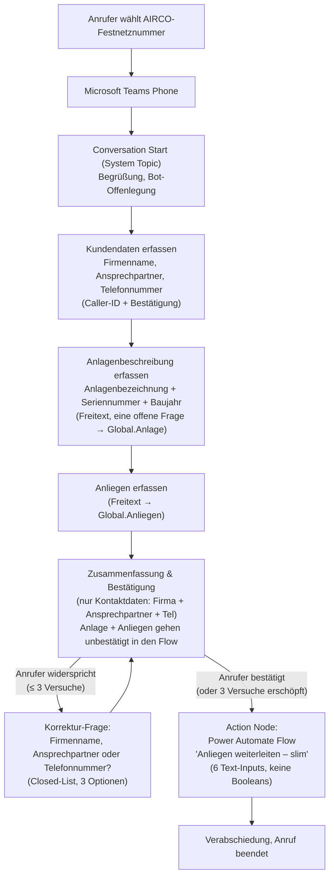
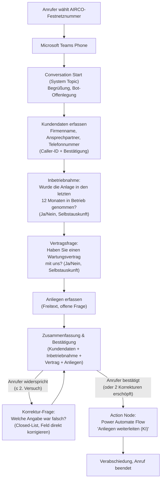
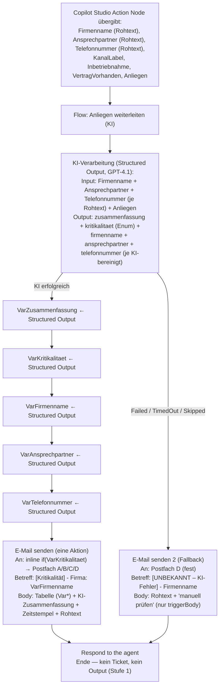
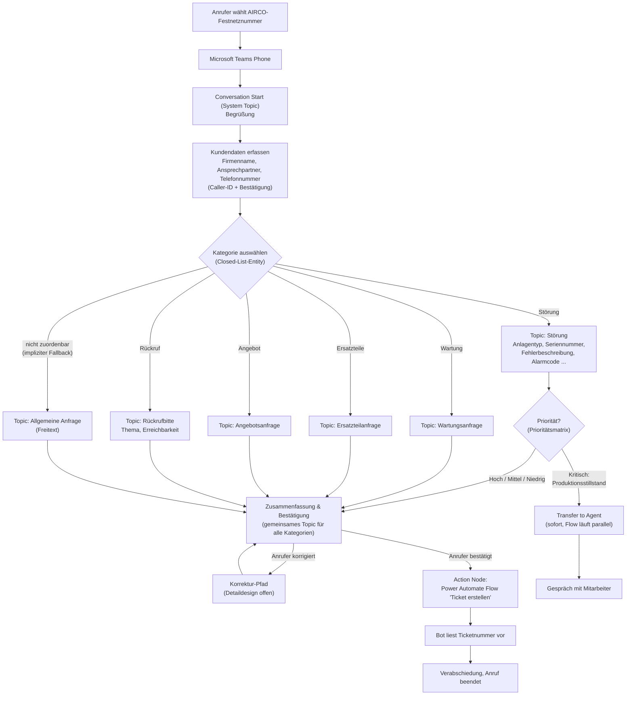
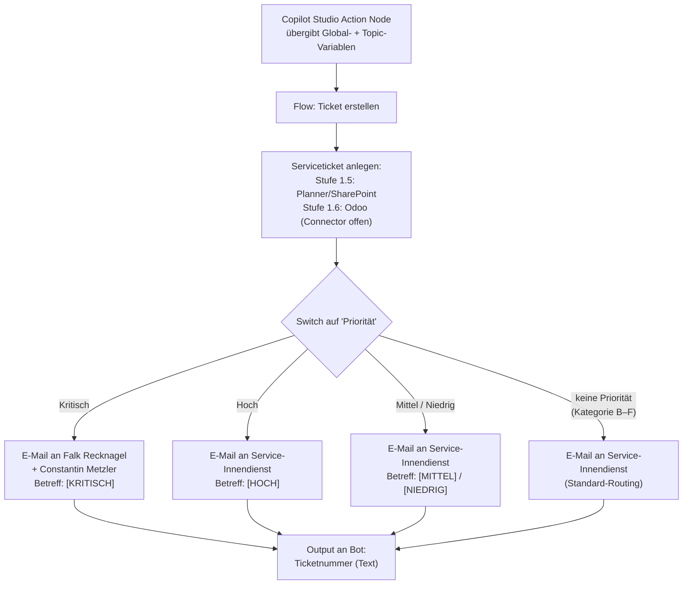

# Architektur: KI-Telefon-Bot AIRCO Systems GmbH

Gesamtarchitektur des Telefon-Bots für den 1st Level Support. Dieses Dokument
beschreibt den **stufenweisen Ausbauplan (Roadmap)**, den **Workflow der
aktuellen Stufe** (Anruf → Gespräch → E-Mail-Weiterleitung), die beteiligten
**Tools**, alle **Entscheidungspunkte** sowie das **Zielbild** der späteren
Ausbaustufen.

Abgrenzung zu den anderen Projektdateien:

| Datei | Inhalt |
|-------|--------|
| `Architektur.md` (dieses Dokument) | Roadmap, Gesamtworkflow je Stufe, Systemkomponenten, Entscheidungspunkte — das stabile „Big Picture" |
| [Topics.md](Topics.md) | Detaillierter Arbeitsstand je Copilot-Studio-Topic (Nodes, Fragen, Variablen), mit Stufen-Zuordnung |
| [ToDos.md](ToDos.md) | Fortschrittsstatus und offene Detailfragen, gruppiert nach Stufen |

> **⚠ Versionshinweis (2026-07-14 — Architektur v2):** Auf Kundenwunsch wurde
> der Ablauf umgestellt: **kein Produktionsstillstand-Prio-Filter**, **keine
> Eskalation/Transfer an einen Menschen** mehr. Stattdessen wird das
> Freitext-Anliegen **im Power-Automate-Flow per KI** zusammengefasst und mit
> einer **Kritikalität** (Kritisch/Hoch/Mittel/Niedrig) versehen, die das
> E-Mail-Routing an vier verschiedene Postfächer steuert. Die vollständige
> **v1-Lösung (mit Produktionsstillstand-Filter und Transfer)** ist unverändert
> im Ordner **`Lösung mit Produktionsstillstand`** gesichert. Umstellungsstand
> dieses Dokuments: Abschnitte 0, 1, 3, 4, 5, 6, 7, 9 = v2; Abschnitt 2
> (Englisch-Sprecher-Regel) hat noch einen offenen v2-Punkt; Abschnitt 8 ist
> Zielbild Stufe 2+ und bleibt unverändert.

---

## 0. Ausbaustufen (Roadmap)

Der Bot wird **stufenweise** aufgebaut. Jede Stufe ist eigenständig produktiv
nutzbar; nichts bereits Erarbeitetes wird verworfen — das Kategorie-Design aus
der ursprünglichen Konzeption ist Stufe-2-Material (siehe Abschnitt 8,
„Zielbild Stufe 2+").

| Stufe | Inhalt | Nutzen | Status |
|-------|--------|--------|--------|
| **0** ⬅ **neue Variante „Slim" (2026-08-18)** | Wie Stufe 1, aber **ohne** Inbetriebnahme- und Vertragsfrage; stattdessen eine neue Frage zur **Anlagenbeschreibung** (Anlagenbezeichnung + Seriennummer + Baujahr, Freitext → `Global.Anlage`). Kundendaten + Anlage + Anliegen werden als **6 Text-Inputs** (keine Booleans) an den Flow „Anliegen weiterleiten – slim" übergeben. Zusammenfassung bestätigt nur die 3 Kontaktfelder (Anlage + Anliegen gehen unbestätigt in den Flow). Läuft parallel zu Stufe 1 als eigenständige Variante. | Schnellerer Gesprächseinstieg; Anlageninformation für den Innendienst ohne Boolean-Fragen; Feedback-Grundlage für Anpassung | Topics + Flow implementiert (2026-08-18); Test ausstehend |
| **1** (v2, 2026-07-14) | Erkennung Vertrag vorhanden/nicht vorhanden und Inbetriebnahme (je Ja/Nein-Frage, Selbstauskunft); Anliegen als **Freitext** erfassen; **kein** Prio-Filter, **keine** Eskalation/Transfer. Der Power-Automate-Flow verarbeitet den Freitext **per KI**: intelligente Kurz-Zusammenfassung + abgeleitete **Kritikalität** (Kritisch/Hoch/Mittel/Niedrig) anhand einer vom Kunden bereitgestellten Störungs-/Anliegenliste. Zusammenfassung + Kritikalität stehen im **E-Mail-Betreff**; das Routing geht je Kritikalität an **eines von vier Postfächern**. (v1-Variante mit Produktionsstillstand-Filter + Transfer → Ordner `Lösung mit Produktionsstillstand`) | Aufwandsreduzierung Hotline, automatische Priorisierung, Nutzerfreundlichkeit, Erfahrungen sammeln | implementiert; Teams-Phone-Verbindung ausstehend |
| **1.5** | Anlage Ticket in **Planner / SharePoint-Liste** (statt nur E-Mail) | Strukturierte Ticketverfolgung ohne ERP-Abhängigkeit | offen |
| **1.6** | Anlage Ticket in **Odoo** (Connector zu definieren) | Tickets direkt im ERP, kein Medienbruch | offen |
| **2** | Ergänzung um **Hauptkategorien** im Gespräch + kategoriespezifische Datenerfassung (z. B. Seriennummer, Wartungsarbeiten, …) | Präzisere Tickets, weniger Rückfragen durch den Innendienst | offen |
| **2.5** | **Automatische Generierung von Angeboten** (Serviceaufträge, Ersatzteile, Anlagen, …), Eintrag in Odoo | Aufwandsreduktion durch präzise Erfassung des Anliegens und Automatisierung der Dateierstellung | offen |
| **3** | **Interaktiver Fehlerbehebungsbot** — Ansteuerung über Telefon-Bot oder Webseite (Chatbot): (a) interne Anwendung, z. B. Schulung Mitarbeiter → Kostenreduktion Schulungen; (b) Kunden **mit** Wartungsvertrag → Kundenakzeptanz; (c) Kunden **ohne** Wartungsvertrag als buchbare Zusatzleistung → zusätzlicher Umsatz | siehe je Zielgruppe | offen |

---

## 1. Systemkomponenten (Tools)

| # | Komponente | Rolle im Workflow | Stufe | Status |
|---|-----------|-------------------|-------|--------|
| 1 | **Microsoft Teams Phone** | Nimmt Anrufe auf der AIRCO-Festnetznummer entgegen (via **Operator Connect** portiert) und leitet sie über **Agents & Queues** (kein Auto Attendant) direkt an den Voice-Agenten weiter. | 1 | in Einrichtung (Resource Account ✅, Portierung + App-Upload offen) |
| 2 | **Microsoft Copilot Studio** | Voice-fähiger Agent (**LLM = GPT-4.1**, einziges Modell mit Sprachunterstützung Stand 21.07.2026). Umgebung muss **EMEA-Region + Dataverse + Pay-As-You-Go** haben. Deployment: Lösung nicht verwaltet exportieren → Teams App `.zip` → Teams Admin Center hochladen. Führt das Gespräch: Begrüßung, Kundendaten, Inbetriebnahme, Vertragsfrage, Freitext-Anliegen, Zusammenfassung. Enthält die gesamte **Gesprächslogik**. Kein Prio-Filter, kein Transfer (v2). | 1 | implementiert (Teams-Phone-Verbindung ausstehend) |
| 3 | **Power Automate** | Flow „Anliegen weiterleiten (KI)": empfängt die Variablen vom Bot, **verarbeitet das Anliegen per KI** (Zusammenfassung + Kritikalität anhand der Störungsliste) und sendet die E-Mail an eine feste Mailbox (`service@airco-systems.de`, seit 2026-09-04 endgültig — kein Routing auf mehrere Postfächer mehr). Enthält die gesamte **Geschäftslogik** (KI-Priorisierung, aktuell ohne Postfach-Differenzierung). | 1 | erledigt (Störungsliste ausstehend, auf spätere Stufe verschoben) |
| 4b | **Structured-Output-Node (GPT-4.1, in Power Automate)** | Ein KI-Node mit JSON-Schema-Structured-Output liefert `zusammenfassung` + `kritikalitaet` (Enum) in einem Modellaufruf. Ersetzt den ursprünglich geplanten Zwei-Schritt-Ansatz (Agent-Node + Classify-Node). | 1 | erledigt (2026-07-20) |
| 4 | **E-Mail (Exchange/Outlook)** | Benachrichtigung der Verantwortlichen gemäß Routing. | 1 | vorhanden |
| 5 | **Planner / SharePoint-Liste** | Ticketablage ohne ERP. | 1.5 | offen |
| 6 | **ERP-System Odoo** | Ziel der Serviceticket-Erstellung; Connector noch zu definieren. | 1.6 | offen |

**Architekturprinzip:** *Gesprächslogik im Bot, Geschäftslogik im Flow.*
Der Bot entscheidet, **was gefragt** wird; der Flow entscheidet, **wie
geroutet und wer informiert** wird. Ändert sich das Routing, muss nur der
Flow angepasst werden — kein einziges Topic.

**KI-Verarbeitung des Anliegens ist in v2 fester Bestandteil — aber im Flow,
nicht im Bot** (Kundenwunsch 2026-07-14). Der Bot erfasst das Anliegen nur als
Freitext und übergibt es; die eigentliche Intelligenz (Problem erkennen,
zusammenfassen, Kritikalität ableiten) läuft **nachgelagert im
Power-Automate-Flow** per AI Builder / GPT-Prompt gegen die vom Kunden
bereitgestellte Störungs-/Anliegenliste. Das hält das Architekturprinzip ein
(„Gesprächslogik im Bot, Geschäftslogik im Flow") und den Bot latenzarm — die
Kritikalität wird ohnehin erst fürs E-Mail-Routing gebraucht, nicht während des
Gesprächs.

Abzugrenzen von der früher geplanten **Kategorie-Klassifizierung A–F**: Die
bleibt **Stufe-2-Material** (explizite Gesprächsfrage „Kategorie auswählen",
siehe Abschnitt 8). Die v2-KI erkennt kein Kategorieschema, sondern erzeugt
**Freitext-Zusammenfassung + Kritikalitätsstufe**.

---

## 2. Agent-Konfiguration (Copilot Studio) — Stufe 1

Neben der Topic-Ebene (Abschnitt 3, Details siehe [Topics.md](Topics.md)) hat
der Copilot-Studio-Agent eine übergeordnete **Agent-Ebene**, die für die
gesamte Konversation gilt, unabhängig vom aktuellen Topic: Orchestrierungsmodus,
Wissen, Tools und Anweisungen.

| Bereich | Entscheidung Stufe 1 | Begründung |
|---|---|---|
| **Agent-Typ / Orchestrierung** | **Basic Voice Agent**, Classic Orchestration (kein generatives Routing) | Vorhersagbarkeit und geringe Latenz pro Turn sind bei Telefonie wichtiger als dialogische Flexibilität; passt zum starren Topic-Flussdiagramm (Abschnitt 3) |
| **Wissen** | keine Wissensquellen verknüpft | Vermeidet Halluzinationsrisiko bei vorgelesenen, nicht validierten Inhalten; hält am Architekturprinzip „Gesprächslogik im Bot, Geschäftslogik im Flow" (Abschnitt 1) ein |
| **Tools (Agent-Ebene)** | Flow „Anliegen weiterleiten" als Tool registriert, aber **„Allow agent to decide dynamically when to use the tool"** deaktiviert und alle Inputs auf „Custom value" (→ `Global.*`-Variablen) statt „Dynamically fill with AI" gesetzt | Flow-Aufrufe laufen weiterhin ausschließlich explizit über Action Nodes innerhalb von Topics (Node 8/9 in „Zusammenfassung & Bestätigung", Abschnitt 4); die Input-Zuordnung erfolgt zentral auf der Tool-Konfigurationsseite (gilt für alle Action Nodes, die dieses Tool aufrufen) statt einzeln im Node — ohne generative Orchestrierung gibt es weiterhin kein dynamisches Tool-Picking durch den Agenten selbst |
| **Anweisungen** | Persona/Ton + Leitplanken + Sprachvorgabe (Wortlaut unten) | Einzige Stellschraube der Agent-Ebene, die bei Classic-only-Orchestrierung noch wirkt — u. a. für die KI-gestützte Slot-Erkennung in Freitext-Question-Nodes |

### Anweisungen-Text (Stufe 1)

> Du bist der digitale Service-Assistent der AIRCO Systems GmbH für den
> 1st-Level-Support (Industriekompressoren, Stickstoffanlagen,
> Druckluftaufbereitung). Sprich den Anrufer stets formell mit „Sie" an, in
> sachlich-technischem, klarem Ton — keine Umgangssprache, keine
> überschwängliche Freundlichkeit.
>
> Bleibe strikt beim Thema: Beantworte ausschließlich Anliegen, die mit
> AIRCO-Produkten, -Service oder dem laufenden Support-Gespräch zu tun haben.
> Weiche bei fachfremden Fragen höflich aus und lenke zurück zum eigentlichen
> Anliegen.
>
> Nenne niemals Preise, Kosten oder Kostenschätzungen. Versuche niemals, eine
> technische Störung selbst zu diagnostizieren oder zu beheben. Mache keine
> Zusagen zu Reaktions- oder Bearbeitungszeiten, die von der vereinbarten SLA
> abweichen.
>
> Das Gespräch wird ausschließlich auf Deutsch geführt. Erkennst du, dass der
> Anrufer Englisch spricht, antworte einmalig auf Englisch: „Currently this
> service is only available in German. We will contact you soon." Beende danach
> die Konversation.

**Englisch-Sprecher Stufe 1 (interim):** Der Anweisungstext steuert den Ton,
kann aber keinen Flow aufrufen. Ein Ticket wird bei englischsprachigen Anrufern
in Stufe 1 daher **nicht zuverlässig erstellt**. Zurückgestellt: eigenes Topic
„Englischer Anrufer" (Trigger-Phrasen → Caller-ID sichern → Flow → englische
Nachricht → EndConversation) — siehe ToDos.md. Stufe 2 bringt volle
Englisch-Unterstützung mit übersetzten Topic-Texten.

---

## 2a. Voice-Kanal-Einstellungen (Sprachempfindlichkeit, Timeouts, Halten & Fortsetzen)

Ergänzend zur Agent-Ebene (Abschnitt 2) gibt es kanalspezifische Voice-Einstellungen
im Sprachkanal von Copilot Studio (`Unterhaltungsverhalten` → Karten „Stille",
„Spracherfassung", „Halten und Fortsetzen"), die unabhängig vom Topic-Design
das Gesprächsgefühl am Telefon prägen. Ausgelöst durch Testfeedback (siehe
ToDos.md, Abschnitt „Testing-Feedback"):

| Einstellung | Wert | Begründung |
|---|---|---|
| **Sprachempfindlichkeit / Unterbrechungsschwelle** (Karte „Stille") | 0,5 → **0,2** (umgesetzt 2026-08-25) | Feedback #19: Bot hörte sich über lauten Lautsprecher selbst und unterbrach bei kleinen Hintergrundgeräuschen (Barge-in auf Rauschen statt echter Anrufer-Sprache). Niedrigerer Wert = weniger empfindlich gegenüber leisen/kurzen Geräuschen. |
| **Äußerungsende-Timeout** (Karte „Spracherfassung") | 1500 ms → **2500 ms** (Umsetzung offen, **priorisiert**) | Reduziert das Risiko, dass der Bot Anrufer mitten in einer Denkpause für „fertig gesprochen" hält. **Hochgestuft 2026-08-25** nach Testerbericht (Anlagenbezeichnung): wirkt als einziger Hebel global auf alle Question Nodes und setzt an der Ursache an, nicht am Symptom — siehe „Turn-Taking-Problem" unten. |
| **Spracherkennungs-Timeout** (Karte „Spracherfassung") | 12000 ms, Option „Spracherkennungs-Timeout" bleibt aktiv (nicht „Kein Erkennungs-Timeout") | Muss aktiv bleiben, da die bestehende `OnSilence`-Logik („Sind Sie noch da?" → `EndConversation`, siehe Abschnitt 7 / ToDos.md Zeile 88) sonst nie auslöst. |
| **Halten und Fortsetzen** | Trigger-Wörter + Nachrichten zu befüllen (Vorschläge in ToDos.md); Zeitüberschreitung 15000 ms / 2 Wiederholungen (Standardwerte beibehalten) | Deckt das domänentypische Szenario „Kunde muss kurz zum Typenschild/Kompressor laufen, um Seriennummer/Anlagenbezeichnung abzulesen" gezielt ab (Topic „Anlage erfassen", Stufe 0 Slim) — präziser als eine pauschale Anhebung der Timeouts für das ganze Gespräch. |

⚠️ Alle Werte sind Startwerte, kein abgeschlossenes Tuning — nach dem nächsten
Testlauf prüfen, ob Anrufer eher abgewürgt wirken (Timeouts weiter hoch) oder
das Gespräch träge wirkt (wieder runter).

### Turn-Taking-Problem (Analyse 2026-08-25)

Testerbericht: „Er hat mich nach der Anlagenbezeichnung gefragt, ich habe 2–3
Sekunden gezögert, und er hat schon mit der Anliegenfrage angefangen, als ich
die Anlagenbezeichnung gesagt hatte. Mein Anliegen konnte ich dann gar nicht
mehr sagen."

**Mechanik:** Der Spracherkennungs-Timeout (12 s) kann das nicht ausgelöst
haben — bei reiner Stille hätte `OnSilence` („Sind Sie noch da?") gegriffen.
Wahrscheinlicher: ein Geräusch beim Zögern (Einatmen, „ähm") startet die
Erkennung, **1500 ms später** gilt die Äußerung als beendet, ein Fragment landet
in `Global.Anlage`, und der `BeginDialog` zum nächsten Topic feuert sofort.
Die eigentliche Antwort des Anrufers landet dann im **nächsten** Question Node
— und weil alle Nodes `StringPrebuiltEntity` (Catch-all) verwenden, wird sie
dort kommentarlos als gültige Antwort akzeptiert.

**Warum das die gefährlichere Fehlerklasse ist:** Es entsteht kein Fehler, kein
Fallback, keine Rückfrage. Der Flow läuft grün, die E-Mail geht raus — mit einer
Typenbezeichnung im Feld „Anliegen" und einem nie erfassten Anliegen. Anders als
Feedback #17 („kein passendes Thema") merkt das niemand.

**Struktureller Zusammenhang:** Ein Catch-all-Entity kann per Definition nicht
scheitern — jede Äußerung ist eine gültige Antwort, auch die falsche. Damit
gibt es keinen Punkt, an dem ein Reprompt oder eine Fehlerbehandlung überhaupt
auslösen *könnte*. Das ist der Preis der bewussten Entscheidung, wegen
schlechter Erkennung natürlicher Sprache auf typisierte Entities zu verzichten
(siehe Topics.md).

**Entschieden (2026-08-25) — Reihenfolge nach Aufwand/Wirkung:**

1. **Äußerungsende-Timeout 1500 → 2500 ms.** Ein Feld, wirkt global auf alle
   Question Nodes, setzt an der Ursache an. Zuerst umsetzen.
2. **Wortlaut der Anlagen-Frage bleibt unverändert** („Bitte teilen Sie uns die
   Anlagenbezeichnung, Seriennummer und das Baujahr mit."). Bewusst so
   entschieden: Ein Aufteilen in drei Einzelfragen würde das Pausenrisiko
   senken, aber das Gespräch verlängern — und Gesprächskürze war ausdrückliche
   Kundenpriorität (Feedback #2). **Bekanntes Restrisiko:** drei Angaben in
   einer Antwort = zwei natürliche Denkpausen mitten in der Antwort.
3. **Erst danach messen.** Tritt der Effekt weiterhin auf, einen
   Plausibilitätscheck (`Len(Trim(...)) < 3` → einmal nachfragen, davor
   `SetVariable = Blank()`, sonst überspringt sich der Question Node selbst)
   nachrüsten — dann aber **nur bei `Global.Anliegen`**, dem einzigen
   geschäftskritisch unverzichtbaren Feld, nicht bei allen Fragen.

**Verworfen:** Blank-/Längen-Check flächendeckend über alle Question Nodes.
Drei Zusatzknoten pro Frage plus willkürlicher Schwellwert behandeln das
Symptom, während der Schaden 1500 ms früher entsteht; eine Prüfung kann nicht
zurückholen, was der Anrufer gesagt hat, während der Bot schon weiterredete.

**Ebenfalls offen (nicht entschieden):** Alle Question Nodes stehen auf
`allowInterruption: true`. Das öffnet bei jeder Frage die Orchestrator-Prüfung
auf einen möglichen Themenwechsel — passt die Äußerung zu keinem Thema, führt
das zu `OnUnknownIntent` (Feedback #17). In einem durchgängig redirect-gesteuerten
Ablauf ohne alternative Themen ist der Nutzen fraglich; `false` würde diese Tür
schließen. Vor einer Umstellung ist zu prüfen, ob `allowInterruption` in
Copilot Studio auch das akustische Barge-in betrifft oder nur den Themenwechsel.

---

## 3a. Gesprächsfluss Stufe 0 — Slim-Variante (2026-08-18)



**Unterschiede zu Stufe 1:**

| Aspekt | Stufe 1 | Stufe 0 (Slim) |
|--------|---------|----------------|
| Inbetriebnahme-Frage | ✅ Ja/Nein | ❌ entfällt |
| Vertragsfrage | ✅ Ja/Nein | ❌ entfällt |
| Anlagenbeschreibung | ❌ entfällt | ✅ Freitext (Bezeichnung + SN + Baujahr) |
| Zusammenfassung | 4 Varianten (Inbetrieb × Vertrag) + Anliegen | 1 kombinierter Summary+Question-Node (nur Kontaktdaten) |
| Korrekturfelder | 5 (+ Inbetriebnahme + Vertrag) | 3 (nur Kontaktdaten) |
| Flow-Inputs | 5 Text + 2 Boolean | 6 Text, keine Boolean |
| Flow-Name | „Anliegen weiterleiten (KI)" | „Anliegen weiterleiten – slim" |
| flowId | `299a805a-9036-df8d-ed1d-ec8dbc0fcd99` | `019885f0-e29a-f111-b8db-7ced8d476627` |

---

## 3. Gesprächsfluss Stufe 1 (aktueller Bauplan)



Gegenüber v1 entfernt: der Prio-Filter-Knoten („Steht Ihre Produktion still?"),
der `Unterhaltung übertragen`-Zweig samt paralleler [KRITISCH]-Mail sowie die
Transfer-Eskalation nach 3× Widerspruch. Die Priorisierung passiert jetzt
**nachgelagert per KI im Flow** (Abschnitt 4).

Querschnitts-Verhalten (gilt in jedem Topic, nicht je Node eingezeichnet):

- **Unerkannte Eingabe / Stille:** Bot wiederholt die Frage einmal → beim
  zweiten Fehlversuch **kein Transfer mehr** (v2 kennt keine Eskalation an
  einen Menschen). Vorläufiger Default: kurze Entschuldigung + Zusage „wir
  melden uns"; liegen Anliegen/Kundendaten bereits vor, regulär weiter zum
  Flow, sonst Gesprächsende. **Konkrete Regel noch offen (siehe Abschnitt 9).**
- **Sicherheitsrelevantes Problem** (Brand, Rauch): In v1 sofortiger Transfer —
  in v2 gibt es keinen Transfer. Vorläufiger Default: dringlicher Hinweis an
  den Anrufer + höchste Kritikalität in der E-Mail; das zugehörige Topic ist
  weiterhin nicht gebaut. **Behandlung noch offen (siehe Abschnitt 9).**

> **v2-Hinweis:** Der Node-Typ **„Unterhaltung übertragen"** (Transfer an eine
> externe Telefonnummer) entfällt in v2 vollständig. Der gesamte
> Eskalations-/Transfer-Zweig aus v1 (inkl. Geschäftszeiten-Prüfung und
> Zielrufnummer) ist im Backup-Ordner „Lösung mit Produktionsstillstand"
> dokumentiert und wird hier nicht weiter gepflegt.

---

## 4. Backend-Workflow Stufe 1 (Power Automate Flow „Anliegen weiterleiten")



**Inputs vom Bot:** `Firmenname`, `Ansprechpartner`, `Telefonnummer`,
`KanalLabel` (Text: „Telefon"/„Chat" — direkt vom Bot gesetzt, kein
Umwandlungsschritt im Flow nötig; entschieden 2026-07-16), `Inbetriebnahme` (Ja/Nein),
`VertragVorhanden` (Ja/Nein), `Anliegen` (Freitext). —
`Produktionsstillstand` entfällt in v2.

**KI-Verarbeitung (Ein-Schritt, Structured Output, 2026-07-21):**

Ein einziger KI-Node (GPT-4.1) mit **Structured Output** (JSON-Schema) liefert fünf
Felder in einem Modellaufruf. **Inputs:** `Firmenname` (Rohtext vom Bot),
`Ansprechpartner` (Rohtext), `Telefonnummer` (Rohtext), `Anliegen` (Freitext).
Der Bot sammelt alle 3 Kontaktfelder als `StringPrebuiltEntity` („Gesamte Antwort
des Benutzers") — Copilot-Studio-Entity-Extraktion (OrganizationPrebuiltEntity etc.)
scheiterte an natürlicher Sprache. Die KI bereinigt die Rohwerte im Flow:

- `zusammenfassung`: Sachlich, max. 3 Sätze, Deutsch. Fallback: „Anliegen unklar. Bitte direkt beim Anrufer nachfragen."
- `kritikalitaet`: Enum `Kritisch | Hoch | Mittel | Niedrig | Other` — das Schema erzwingt einen der fünf gültigen Werte.
- `firmenname`: KI-extrahierter Firmenname aus Rohtext (z. B. „mein Firma heißt mosaiic GmbH" → „mosaiic GmbH").
- `ansprechpartner`: KI-extrahierter Name aus Rohtext (z. B. „ich bin der Michael Doukas" → „Michael Doukas").
- `telefonnummer`: KI-extrahierte Telefonnummer aus Rohtext.

Die Ausgaben werden in fünf Flow-Variablen zwischengespeichert:
- `VarZusammenfassung` (String) ← `body('KI-Verarbeitung')?['structuredOutput/zusammenfassung']`
- `VarKritikalitaet` (String) ← `body('KI-Verarbeitung')?['structuredOutput/kritikalitaet']`
- `VarFirmenname` (String) ← `body('KI-Verarbeitung')?['structuredOutput/firmenname']`
- `VarAnsprechpartner` (String) ← `body('KI-Verarbeitung')?['structuredOutput/ansprechpartner']`
- `VarTelefonnummer` (String) ← `body('KI-Verarbeitung')?['structuredOutput/telefonnummer']`

**⚠ Pitfall:** `outputs('KI-Verarbeitung')?['structuredOutput/…']` liefert zur Laufzeit leer —
`structuredOutput` liegt eine Ebene tiefer unter `body`. Immer `body()` verwenden,
nicht `outputs()`. Der grüne Validierungshaken in Power Automate prüft nur Syntax,
nicht ob der Pfad zur Laufzeit einen Wert liefert.

**Kritikalitäts-Kriterien:**

| Kategorie | Beschreibung |
|-----------|-------------|
| **Kritisch** | Produktionsstillstand. Anlage vollständig ausgefallen, Produktion steht still. |
| **Hoch** | Störung ohne Stillstand. Anlage läuft eingeschränkt, Produktion beeinträchtigt. |
| **Mittel** | Geplante Anfrage: Wartungsanfrage, Ersatzteilanfrage oder Angebotsanfrage. |
| **Niedrig** | Rückrufbitte, allgemeine Fragen oder sporadisches Problem ohne Produktionseinfluss. |
| **Other** | Automatischer Fallback für nicht eindeutig klassifizierbare Anliegen. |

**E-Mail-Betreff:** `[<Kritikalität>] - Firma: <Firmenname>` (z.B. `[Kritisch] - Firma: Musterfirma GmbH`).

**E-Mail-Body (HTML, eine E-Mail-Aktion, 2026-07-21):**
1. HTML-Tabelle:
   - Firmenname → `variables('VarFirmenname')` (KI-bereinigt)
   - Ansprechpartner → `variables('VarAnsprechpartner')` (KI-bereinigt)
   - Telefonnummer → `variables('VarTelefonnummer')` (KI-bereinigt)
   - Inbetriebnahme → `if(triggerBody()?['boolean_1'], 'Ja', 'Nein')`
   - Wartungsvertrag → `if(triggerBody()?['boolean'], 'Ja', 'Nein')`
   - Kritikalität → `variables('VarKritikalitaet')`
2. KI-Zusammenfassung (`variables('VarZusammenfassung')`)
3. Zeitstempel (`formatDateTime(convertTimeZone(utcNow(),'UTC','W. Europe Standard Time'),'dd.MM.yyyy HH:mm')`) + KanalLabel (`triggerBody()?['text_4']`)
4. `<hr>` Trennlinie
5. Rohtext Anliegen (`triggerBody()?['text_3']`, Testperiode — Qualitätskontrolle der KI-Zusammenfassung)

**Hinweis:** Die Var*-Werte (Firmenname/Ansprechpartner/Telefonnummer) sind KI-bereinigt.
Die Rohtexte (`text`, `text_1`, `text_2`) werden **nicht** direkt in der E-Mail verwendet —
nur im Rohtext-Abschnitt (text_3 = Anliegen) und im Fallback-Node.

**Routing (⚠ Entscheidung 2026-09-04):** Das ursprüngliche 4-Postfächer-Konzept
wurde **verworfen** — es bleibt dauerhaft bei **einer** Ziel-Mailbox
`service@airco-systems.de` für alle Kritikalitätsstufen. Die inline-`if()`-Logik
im „E-Mail senden"-Node (Kritisch→A, Hoch→B, Mittel→C, Rest→D) ist damit nur
noch technisch vorhanden, alle vier Branches zeigen auf dieselbe Adresse;
Betreff-Präfix und E-Mail-Priorität (High/Normal/Low) bleiben weiterhin
`VarKritikalitaet`-abhängig. Vereinfachung des `if()` auf eine feste Adresse
ist optional (kein funktionaler Unterschied mehr).

**Fallback-Node „E-Mail senden 2":** Feuert nur bei KI-Ausfall
(`Configure run after: Failed / TimedOut / Skipped` auf dem KI-Node). Sendet
Rohtext + Hinweis „manuell prüfen" fest an Postfach D — ausschließlich
`triggerBody()`-Werte, keine Variablen (die wären bei KI-Ausfall nie initialisiert).

**Störungsliste (Knowledge):** Als SharePoint-Datei im Agent-Node hinterlegt —
AIRCO kann sie selbst aktualisieren ohne den Flow anzufassen. Format und
Einbindung werden mit der Kundenlieferung entschieden (Abschnitt 9).

**Kein Ticket und keine Ticketnummer in Stufe 1.** Ausbau:

- **Stufe 1.5:** Flow legt zusätzlich ein Ticket in Planner / einer
  SharePoint-Liste an.
- **Stufe 1.6:** Ticketanlage in Odoo; ab dann `Ticketnummer` als Output an
  den Bot (wird dem Anrufer vorgelesen — siehe Zielbild, Abschnitt 8).

---

## 5. Entscheidungspunkte Stufe 1

| # | Entscheidungspunkt | Ort | Logik | Status |
|---|--------------------|-----|-------|--------|
| E10 | **Inbetriebnahme** | Bot, Topic „Inbetriebnahme" | Ja/Nein-Frage „Wurde die Anlage in den letzten 12 Monaten in Betrieb genommen?" (Selbstauskunft); Info wird an den Flow weitergeleitet und in Node 1 der Zusammenfassung mit vorgelesen | entschieden |
| E2 | **Vertragsfrage** | Bot, Topic „Vertragsfrage" | Ja/Nein-Frage (Selbstauskunft); Verifikation durch Innendienst beim Bearbeiten | offen |
| ~~E1~~ | **Prio-Filter** (Produktionsstillstand) | — | **Entfällt in v2 (2026-07-14)** — kein Prio-Filter, keine Frage „Steht Ihre Produktion still?" mehr. Die Priorisierung erfolgt nachgelagert per KI im Flow (siehe E7/E8). Vollständige v1-Logik (Geschäftszeiten-Prüfung + Transfer) im Backup-Ordner „Lösung mit Produktionsstillstand" | entfällt in v2 |
| E3 | **Sicherheits-Eskalation** | Bot, querschnittlich | Brand/Rauch erkannt → in v1 sofortiger Transfer; **in v2 kein Transfer verfügbar**. Vorläufiger Default: dringlicher Hinweis an den Anrufer + höchste Kritikalität in der E-Mail. Behandlung + Erkennungsmechanismus offen | **offen (v2)** — Topic noch nicht gebaut |
| E4 | **Unerkannte Eingabe / Stille** | Bot, querschnittlich | Stille: System-Topic „Stille-Erkennung" → „Sind Sie noch da?" → bei erneuter Stille: Ansage + `EndConversation` (kein Transfer). Unerkannte Eingabe: System-Topic „Spracheingabe nicht erkannt" → „Können Sie es bitte wiederholen?" (1 Wiederholung); zweiter Fehlversuch löst in v2 **keinen Transfer** mehr aus → vorläufiger Default: Entschuldigung + ggf. weiter zum Flow / Gesprächsende (offen, siehe Abschnitt 9) | angepasst (v2) |
| E9 | **Aktiver Mitarbeiter-Wunsch (Interruption)** | Bot, querschnittlich (Trigger-Phrase „Ich möchte mit einem Mitarbeiter sprechen") | In v1 → Transfer. **In v2 kein Live-Transfer**: Bot weist freundlich darauf hin, dass er das Anliegen aufnimmt und ein Mitarbeiter sich meldet, und erfasst weiter. Genaue Formulierung/Verhalten offen | **offen (v2)** |
| E5 | **Telefonnummer-Quelle** | Bot, Topic „Kundendaten erfassen" | Caller-ID vorschlagen + bestätigen; Fallback aktive Nachfrage bei Zentrale-Anrufen | in Bearbeitung |
| E6 | **Bestätigung / Korrektur** | Bot, Topic „Zusammenfassung & Bestätigung" | Anrufer bestätigt → Flow; widerspricht → Closed-List-Frage nach dem falschen Feld, gezielte Korrektur-Nachfrage direkt im Topic, danach erneutes Vorlesen; max. 2 Korrekturversuche, danach in v2 **kein Transfer** → Flow trotzdem auslösen (mit Hinweis „vom Anrufer nicht final bestätigt") + Gesprächsende | angepasst (v2) |
| E7 | **KI-Verarbeitung (Zusammenfassung + Kritikalität)** | Power Automate | Ein Structured-Output-Node (GPT-4.1) liefert `zusammenfassung` + `kritikalitaet` (Enum) in einem Aufruf → VarZusammenfassung / VarKritikalitaet. **Kategorie-Klassifizierung A–F** bleibt Stufe-2-Material. | erledigt (2026-07-20) |
| E8 | **E-Mail-Routing** | Power Automate | Inline-`if()` im Empfänger-Feld einer einzigen E-Mail-Aktion: Kritisch→PostfachA, Hoch→B, Mittel→C, Rest→D. Betreff = `[Kritikalität] - Firma: Firmenname`. Fallback-Node „E-Mail senden 2" bei KI-Ausfall (Configure run after: Failed/TimedOut/Skipped). Postfach-Adressen fehlen noch (wartet auf AIRCO). | erledigt bis auf Postfach-Adressen |
| E11 | **Fallback / kein Thema erkannt** (Testfeedback #17 „Themenerkennung") | Bot, System-Topic „Fallback" (separat von `OnUnrecognizedSpeech` — greift, wenn die Spracherkennung erfolgreich war, aber kein Topic-Trigger passt) | Entschieden (2026-08-25): keine Rückfrage-Schleife und kein Versuchszähler — kurze Entschuldigung, danach direkter Redirect zu Topic „Anliegen erfassen" (Annahme: Anrufer hat trotzdem ein Servicefall, nur unpassend formuliert). Vorhandenen Escalate-Verweis im Standard-Fallback-Topic entfernen, analog zu den bereits deaktivierten System-Topics (Abschnitt 7 / ToDos.md Zeile 87–92). | entschieden, Umsetzung + Praxistest offen |

Die 4-stufige Kritikalität (Kritisch/Hoch/Mittel/Niedrig) wird in v2 **von der
KI im Flow** vergeben und steuert das E-Mail-Routing (E7/E8). Sie tritt damit
an die Stelle des früheren binären Produktionsstillstand-Filters; die
Zuordnung der Kriterien orientiert sich an der Prioritätsmatrix aus der
Fachdomäne (siehe CLAUDE.md).

---

## 6. Variablen-Architektur Stufe 1

In Stufe 1 gibt es keine Kategorie-Topics — alle erfassten Werte werden als
**Global Variables** geführt:

**Stufe 1:**

```
Global Variables   (überall verfügbar)
├── Global.Firmenname            (Topic „Kundendaten erfassen")
├── Global.Ansprechpartner       (Topic „Kundendaten erfassen")
├── Global.Telefonnummer         (Topic „Kundendaten erfassen")
├── Global.KanalLabel            (Topic „Kundendaten erfassen"; „Telefon" wenn Caller-ID vorhanden, „Chat" sonst)
├── Global.Inbetriebnahme        (Topic „Inbetriebnahme", Boolean)
├── Global.VertragVorhanden      (Topic „Vertragsfrage", Boolean)
└── Global.Anliegen              (Topic „Anliegen erfassen", Freitext)
```

**Stufe 0 (Slim) — 2026-08-18:**

```
Global Variables   (überall verfügbar)
├── Global.Firmenname            (Topic „Kundendaten erfassen")
├── Global.Ansprechpartner       (Topic „Kundendaten erfassen")
├── Global.Telefonnummer         (Topic „Kundendaten erfassen")
├── Global.KanalLabel            (Topic „Kundendaten erfassen"; „Telefon" / „Chat")
├── Global.Anlage                (Topic „Anlage erfassen", Freitext: Bezeichnung + SN + Baujahr)
└── Global.Anliegen              (Topic „Anliegen erfassen", Freitext)
```

Entfallen in Stufe 0: `Global.Inbetriebnahme`, `Global.VertragVorhanden` (keine Boolean-Fragen).
Neu in Stufe 0: `Global.Anlage` — wird als `text_5` an den Flow übergeben.

**Trigger-Input-Reihenfolge Stufe 0 (Flow „Anliegen weiterleiten – slim") — niemals ändern:**

| Power-Automate-Feld | Bot-Variable |
|---------------------|-------------|
| `text` | `Global.Firmenname` |
| `text_1` | `Global.Ansprechpartner` |
| `text_2` | `Global.Telefonnummer` |
| `text_3` | `Global.Anliegen` |
| `text_4` | `Global.KanalLabel` |
| `text_5` | `Global.Anlage` |

Die KI-Ergebnisse (Kurz-Zusammenfassung, Kritikalität) sind **keine** Bot-Variablen
— sie entstehen erst im Power-Automate-Flow und werden nicht an den Bot
zurückgegeben (beide Stufen haben keinen Flow-Output in Stufe 0/1).

**Entscheidungsgrund:** Das gemeinsame Topic „Zusammenfassung & Bestätigung"
und der Action Node müssen alle Werte lesen können. Global Variables lösen
das Sichtbarkeitsproblem für die wenigen Stufe-1-Werte am einfachsten. Die
Topic-Variablen-Strategie (kategoriespezifische Werte leben nur im jeweiligen
Topic) bleibt als **Stufe-2-Konzept** dokumentiert (Abschnitt 8) — dort stellt
sich die Sichtbarkeitsfrage erneut und braucht eine eigene Lösung.

Namenskonvention unverändert: deutsch, PascalCase, ohne Umlaute/ß.

---

## 7. Eskalationswege — in v2 entfallen

**v2 kennt keine Eskalation / keinen Transfer an einen Menschen mehr.** Der
Node-Typ „Unterhaltung übertragen" wird nicht verwendet. Alle Anliegen — auch
kritische — werden gleich behandelt: erfasst, per KI priorisiert und je
Kritikalität an das passende Postfach gemailt (Abschnitt 4). Die zeitnahe
Reaktion übernimmt der Innendienst über das Postfach, nicht ein Live-Transfer.

Die vollständigen v1-Eskalationswege (Produktionsstillstand, Sicherheitsproblem,
2× unerkannte Eingabe, 3× Widerspruch, aktiver Mitarbeiter-Wunsch — jeweils
inkl. Geschäftszeiten-Prüfung, Empfänger und offener Zielrufnummer) sind im
Backup-Ordner „Lösung mit Produktionsstillstand" gesichert.

**Offene Nebenwirkungen** (früher über den Transfer gelöst, jetzt neu zu
entscheiden — siehe Abschnitt 9): Verhalten bei Sicherheitsnotfall,
Englisch-Sprecher, 2× unerkannter Eingabe und aktivem Mitarbeiter-Wunsch.
SLA laut Prozessdokumentation unverändert: 24 h Rückmeldung, 3 Werktage
Beseitigung.

---

## 8. Zielbild Stufe 2+ (zurückgestellt, nicht verworfen)

Das ursprünglich erarbeitete Design mit expliziter Kategoriewahl im Gespräch
und kategoriespezifischer Datenerfassung. Wird ab Stufe 2 wieder aufgegriffen;
die zugehörigen Topic-Details stehen in [Topics.md](Topics.md) (als „Stufe 2"
gekennzeichnet).

### Gesprächsfluss (Zielbild)



### Backend (Zielbild: Flow „Ticket erstellen", ab Stufe 1.5/1.6/2)



### Variablen-Strategie (Zielbild)

```
Global Variables   (Topic „Kundendaten erfassen", überall verfügbar)
├── Global.Firmenname
├── Global.Ansprechpartner
└── Global.Telefonnummer

Topic Variables    (leben nur im jeweiligen Kategorie-Topic)
├── Störung:      Anlagentyp, Seriennummer, Fehlerbeschreibung, Alarmcode,
│                 Priorität, Störungsdauer, Maßnahmen, Standort
├── Wartung:      letzte Wartung, Betriebsstunden, Zeitraum, Dringlichkeit
├── Ersatzteil:   Artikelnummer, Modell, Seriennummer, Menge,
│                 Lieferadresse, Expressversand
├── Angebot:      Anwendung, Leistung, bestehende Anlage, Zeitrahmen
├── Rückruf:      Thema, Erreichbarkeit
└── Allgemein:    Freitext
```

> **Achtung (offener Punkt, ab Stufe 2 relevant):** Topic Variables sind in
> Copilot Studio standardmäßig nur im eigenen Topic sichtbar. Das gemeinsame
> Topic „Zusammenfassung & Bestätigung" muss die kategoriespezifischen Werte
> aber vorlesen können — das erfordert entweder Variablen-Übergabe beim
> Redirect, „empfangende" Topic-Input-Variablen oder weitere Global Variables.
> Design steht aus (eigene Sparring-Session, siehe ToDos.md).

### Zielbild-Entscheidungspunkte, die in Stufe 1 entfallen

- **Kategorie-Wahl per Closed-List-Entity** (inkl. der Frage Entity-Reprompt
  vs. Fallback „Allgemeine Anfrage" vs. 2-Versuche-Eskalation) — in Stufe 1
  entfällt die Kategorisierung komplett (Korrektur 2026-07-10); der
  Innendienst sortiert die Kategorie manuell beim Bearbeiten der E-Mail ein.
- **Prioritätsmatrix mit 4 Stufen** — Stufe 1 kennt nur binär
  Produktionsstillstand ja/nein.
- **Ticketnummer vorlesen** — erst ab Ticketanlage (Stufe 1.5/1.6).

---

## 9. Offene Architekturfragen

### Stufe 1 (jetzt relevant)

1. **Caller-ID-Systemvariable** im Teams-Phone-Kanal von Copilot Studio —
   laut Microsoft-Doku „Variables overview" (learn.microsoft.com, Stand
   2026-06-30), Abschnitt „System variables", ist `Activity.From.Name`
   (String) „The channel-specific user-friendly name of the sender" — eine
   **„hidden" System-Variable**, die nicht im normalen Variablen-Picker
   erscheint, sondern nur per Power-Fx-Formel mit `System.`-Präfix
   zugänglich ist: `System.Activity.From.Name`. Zugriff in der Praxis: In
   einem „Variable festlegen"-Node (Assign) die Formel `System.Activity.
   From.Name` einer normalen Topic-/Global-Variable zuweisen; diese dann
   ganz normal im Nachrichtentext verwenden (System-Variablen selbst lassen
   sich nicht direkt in Nachrichtentexte einfügen).
   **Verifiziert im Test-Panel** (2026-07-08, Simulation via `/debug set
   Activity.From.Name "+49301234567"`): Die dynamische Nachricht in Node 3a
   zeigte korrekt „Ich sehe, Sie rufen von der Nummer +49301234567 an." —
   die Variable trägt also im simulierten Kontext tatsächlich die Rufnummer.
   **Noch offen**: Bestätigung unter realen Telefonie-Bedingungen (echter
   Anruf über Teams Phone), da Test-Panel-Audio laut Microsoft-Doku anders
   verläuft als echte Telefonie (siehe Abschnitt 9, Punkt „Praxistest").
   Zusätzlich beim Zuweisen der Variable per „Variablenwert festlegen"-Node
   beobachtet: Auswahl über den normalen Objekt-Picker erzeugte einen
   Laufzeitfehler (`InvalidContent`, fehlende Eigenschaften) — Workaround:
   Wert per Power-Fx-Formel-Editor (`fx`-Symbol) explizit als
   `System.Activity.From.Name` eintragen statt über den Picker auswählen.
2. **Zentrale-Erkennung:** Woran erkennt der Bot, dass die Caller-ID eine
   Sammelnummer ist (Abgleichliste bekannter Zentralnummern)?
3. ~~**KI-Klassifizierung — Werkzeugwahl**~~ — hinfällig (2026-07-10):
   KI-Klassifizierung entfällt komplett in Stufe 1, siehe Abschnitt 1.
4. ~~**Korrektur-Pfad** in „Zusammenfassung & Bestätigung"~~ — entschieden:
   Closed-List-Frage nach dem falschen Feld, gezielte Korrektur-Nachfrage
   direkt im Topic (kein Redirect zum Ursprungs-Topic, da das dessen Anfang
   startet statt einen einzelnen Node), danach erneutes Vorlesen; max. 2
   Korrekturversuche, danach `Unterhaltung übertragen` (siehe
   [Topics.md](Topics.md)). **Weiterhin offen**: Synonym-Tabelle für die
   `Korrekturfeld2`-Entity (siehe ToDos.md).
5. ~~**Erreichbarkeit außerhalb der Geschäftszeiten**~~ — entschieden für
   „Prio-Filter": Mo–Fr 8–17 Uhr = Geschäftszeit (Power Fx-Prüfung); außerhalb
   kein Transfer-Versuch, stattdessen nur Flow „Anliegen weiterleiten" +
   Ansage + Gesprächsende (siehe [Topics.md](Topics.md)). **Weiterhin offen**:
   ob dieselbe Prüfung auch bei Sicherheits-Eskalation und 2×-unerkannt-Regel
   gelten soll (siehe Abschnitt 7), und die konkrete Zielrufnummer für den
   Transfer (siehe ToDos.md).
6. ~~**[KRITISCH]-E-Mail beim Sofort-Transfer**~~ — v1-Entscheidung, mit dem
   Transfer in v2 entfallen (im Backup-Ordner dokumentiert).

**Neu in v2 (2026-07-14):**

13. ~~**Postfach-Adressen je Kritikalität**~~ — **entschieden (2026-09-04)**: verworfen, dauerhaft eine Mailbox `service@airco-systems.de` für alle Stufen.
14. **Bereitstellung der Störungs-/Anliegenliste** — Format und Einbindung in
    den KI-Schritt (Prompt-Text vs. Datei/Tabelle im Flow vs. Wissensquelle);
    der Kunde liefert die Liste noch.
15. **KI-Werkzeug im Flow** — AI Builder „Text mit GPT erstellen" vs. eigener
    Prompt/Connector; Modellwahl, Kosten, Datenschutz/Region.
16. **Kritikalitäts-Prompt** — genaue Kriterien/Beispiele, damit die vier
    Stufen reproduzierbar vergeben werden (Orientierung: Prioritätsmatrix in
    CLAUDE.md).
17. **Sicherheitsnotfall ohne Transfer** — Verhalten festlegen (dringlicher
    Hinweis + höchste Kritikalität?).
18. **Englisch-Sprecher ohne Transfer** — höflich beenden + Rückruf zusagen?
19. **Abbruch-/Fehlerfälle ohne Transfer** — 2× unerkannte Eingabe bzw. 2
    erschöpfte Korrekturversuche: Anliegen trotzdem mailen + Gesprächsende?

**Neu aus Testing-Feedback (2026-08-25, siehe ToDos.md „Testing-Feedback"):**

20. **Fallback-Topic Wortlaut & Praxistest (E11)** — genaue Formulierung der
    Entschuldigungsnachricht; Praxistest, ob der Redirect zu „Anliegen
    erfassen" aus jedem Gesprächskontext sauber funktioniert (insbesondere:
    bleiben bereits erfasste `Global.*`-Variablen erhalten, da kein
    `ClearAllVariables` beteiligt ist?).
21. **Sicherheitsnetz bei Gesprächsabbruch** — **erledigt (2026-09-02).**
    Implementierung in drei Teilen:
    - **`Global.FlowAufgerufen`** (Boolean): wird in „Zusammenfassung & Bestätigung
      (Slim)" direkt vor jedem `InvokeFlowAction`-Node auf `true` gesetzt.
    - **„Ende der Unterhaltung"** (`OnSystemRedirect`, `CancelOtherTopics`):
      ConditionGroup vor `EndConversation` — Bedingung
      `Not(IsBlank(Global.Telefonnummer)) && Not(Global.FlowAufgerufen)` → Flow
      mit `If(IsBlank(...))` Wrappern für alle 6 Felder aufrufen. Feuert bei
      Caller-Hang-Up (Channel sendet `EndOfConversation`), nach normalem Abschluss
      (via `BeginDialog → EndofConversation`) und nach Laufzeitfehlern (System-Topic
      „Bei Fehler" leitet ebenfalls hierher).
    - **„Stille-Erkennung"**: `EndDialog` → `BeginDialog → EndofConversation`
      ersetzt — lautlose Abbrüche durchlaufen das Sicherheitsnetz.
    Ergebnis: Sobald `Global.Telefonnummer` gesetzt ist, kommt in jedem Abbruch-Szenario
    eine Partial-Mail in Postfach D. Vollständige Anrufe erhalten genau eine Mail
    (kein Doppelversand durch das Flag).

### Stufe 1.5 / 1.6

7. **Planner vs. SharePoint-Liste** — was passt besser zum Arbeitsablauf des
   Innendiensts?
8. **Odoo-Anbindung:** Welcher Connector (Standard-Odoo-Connector, HTTP/REST,
   oder Zwischenschritt über die SharePoint-Liste aus 1.5)?

### Stufe 2+

9. **Variablen-Sichtbarkeit** im gemeinsamen Topic „Zusammenfassung &
   Bestätigung" bei Topic Variables (siehe Abschnitt 8).
10. **Fallback vs. Eskalation bei „Kategorie auswählen":** Reihenfolge von
    Entity-Reprompt, Fallback „Allgemeine Anfrage" und 2-Versuche-Eskalation.
11. **Rückrufbitte ohne Ticket?** Prüfen, ob eine Rückrufbitte ein ERP-Ticket
    erzeugen soll oder nur eine E-Mail an den Innendienst genügt.
12. **Vertragsprüfung automatisieren:** Ab Stufe 1.5/1.6 Selbstauskunft durch
    Abgleich gegen SharePoint-Liste bzw. Odoo-Kundenstamm ersetzen?
