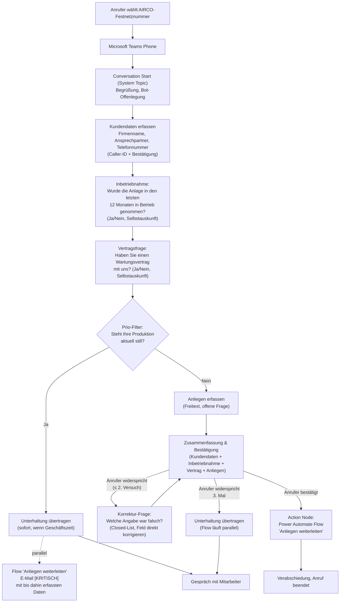
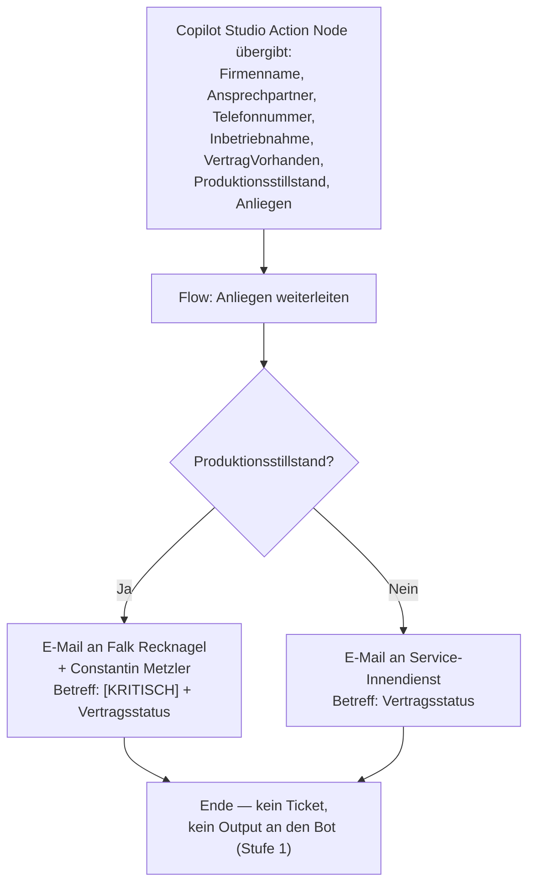
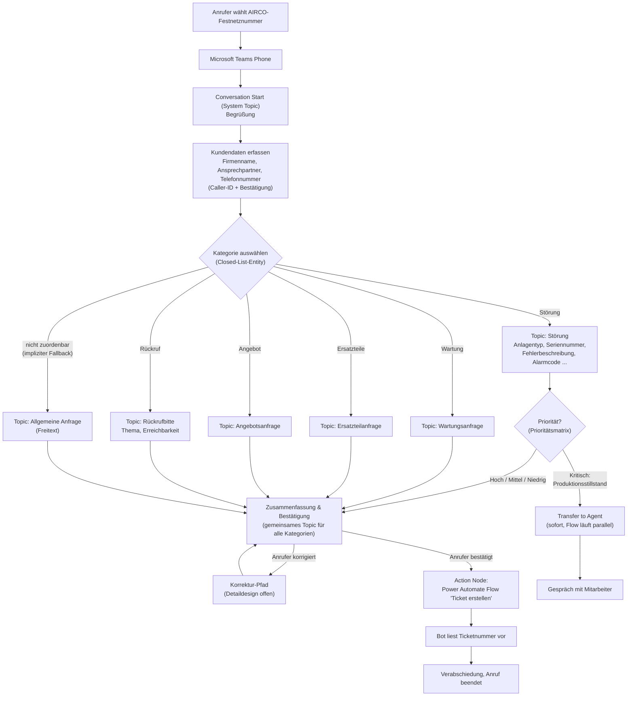
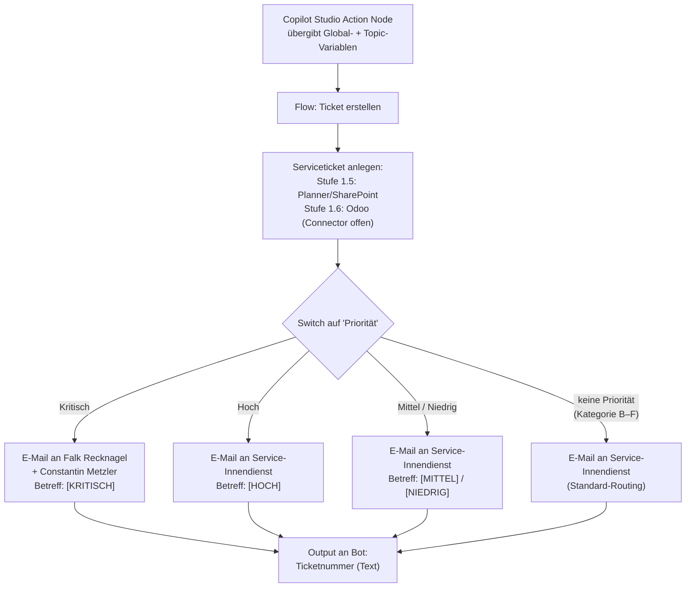

# Architektur: KI-Telefon-Bot AIRCO Systems GmbH

Gesamtarchitektur des Telefon-Bots für den 1st Level Support. Dieses Dokument
beschreibt den **stufenweisen Ausbauplan (Roadmap)**, den **Workflow der
aktuellen Stufe** (Anruf → Gespräch → E-Mail-Weiterleitung), die beteiligten
**Tools**, alle **Entscheidungspunkte** sowie das **Zielbild** der späteren
Ausbaustufen.

Abgrenzung zu den anderen Projektdateien:

| Datei | Inhalt |
|-------|--------|
| `Architektur.md` (dieses Dokument) | Roadmap, Gesamtworkflow je Stufe, Systemkomponenten, Entscheidungspunkte — das stabile „Big Picture" |
| [Topics.md](Topics.md) | Detaillierter Arbeitsstand je Copilot-Studio-Topic (Nodes, Fragen, Variablen), mit Stufen-Zuordnung |
| [ToDos.md](ToDos.md) | Fortschrittsstatus und offene Detailfragen, gruppiert nach Stufen |

---

## 0. Ausbaustufen (Roadmap)

Der Bot wird **stufenweise** aufgebaut. Jede Stufe ist eigenständig produktiv
nutzbar; nichts bereits Erarbeitetes wird verworfen — das Kategorie-Design aus
der ursprünglichen Konzeption ist Stufe-2-Material (siehe Abschnitt 8,
„Zielbild Stufe 2+").

| Stufe | Inhalt | Nutzen | Status |
|-------|--------|--------|--------|
| **1** ⬅ **aktuelle Stufe** | Prio-Anrufe (Produktionsstillstand) herausfiltern und sofort an Mitarbeiter transferieren; Erkennung Vertrag vorhanden/nicht vorhanden und Inbetriebnahme (je Ja/Nein-Frage, Selbstauskunft); Anliegen als **Freitext** erfassen und **unverändert** per E-Mail weiterleiten. **Keine KI-Klassifizierung in Stufe 1** (bewusst rausgenommen, 2026-07-10) — Kategorie-Erkennung kommt erst mit Stufe 2 über die explizite Kategoriewahl im Gespräch (siehe Abschnitt 8), nicht per KI-Raten aus dem Freitext | Aufwandsreduzierung Hotline, Nutzerfreundlichkeit, Erfahrungen sammeln | in Bearbeitung |
| **1.5** | Anlage Ticket in **Planner / SharePoint-Liste** (statt nur E-Mail) | Strukturierte Ticketverfolgung ohne ERP-Abhängigkeit | offen |
| **1.6** | Anlage Ticket in **Odoo** (Connector zu definieren) | Tickets direkt im ERP, kein Medienbruch | offen |
| **2** | Ergänzung um **Hauptkategorien** im Gespräch + kategoriespezifische Datenerfassung (z. B. Seriennummer, Wartungsarbeiten, …) | Präzisere Tickets, weniger Rückfragen durch den Innendienst | offen |
| **2.5** | **Automatische Generierung von Angeboten** (Serviceaufträge, Ersatzteile, Anlagen, …), Eintrag in Odoo | Aufwandsreduktion durch präzise Erfassung des Anliegens und Automatisierung der Dateierstellung | offen |
| **3** | **Interaktiver Fehlerbehebungsbot** — Ansteuerung über Telefon-Bot oder Webseite (Chatbot): (a) interne Anwendung, z. B. Schulung Mitarbeiter → Kostenreduktion Schulungen; (b) Kunden **mit** Wartungsvertrag → Kundenakzeptanz; (c) Kunden **ohne** Wartungsvertrag als buchbare Zusatzleistung → zusätzlicher Umsatz | siehe je Zielgruppe | offen |

---

## 1. Systemkomponenten (Tools)

| # | Komponente | Rolle im Workflow | Stufe | Status |
|---|-----------|-------------------|-------|--------|
| 1 | **Microsoft Teams Phone** | Nimmt Anrufe auf der bestehenden Festnetznummer entgegen und leitet sie an den Voice-Agenten weiter. Führt bei Eskalation den Call Transfer zu einem echten Mitarbeiter aus. | 1 | vorhanden |
| 2 | **Microsoft Copilot Studio** | Voice-fähiger Agent. Führt das Gespräch: Begrüßung, Kundendaten, Prio-Filter, Vertragsfrage, Freitext-Anliegen, Zusammenfassung. Enthält die gesamte **Gesprächslogik**. | 1 | in Aufbau |
| 3 | **Power Automate** | Flow „Anliegen weiterleiten": empfängt alle Variablen vom Bot unverändert und routet E-Mails (kein KI-Aufruf in Stufe 1). Enthält die gesamte **Geschäftslogik** (Routing). | 1 | offen |
| 4 | **E-Mail (Exchange/Outlook)** | Benachrichtigung der Verantwortlichen gemäß Routing. | 1 | vorhanden |
| 5 | **Planner / SharePoint-Liste** | Ticketablage ohne ERP. | 1.5 | offen |
| 6 | **ERP-System Odoo** | Ziel der Serviceticket-Erstellung; Connector noch zu definieren. | 1.6 | offen |

**Architekturprinzip:** *Gesprächslogik im Bot, Geschäftslogik im Flow.*
Der Bot entscheidet, **was gefragt** wird; der Flow entscheidet, **wie
geroutet und wer informiert** wird. Ändert sich das Routing, muss nur der
Flow angepasst werden — kein einziges Topic.

**KI-Klassifizierung (Kategorie A–F + Entitäten aus dem Freitext) ist in
Stufe 1 bewusst kein Bestandteil** (Korrektur 2026-07-10, siehe ToDos.md).
Der Flow leitet den Freitext unverändert weiter; der Innendienst sortiert
die Kategorie manuell beim Bearbeiten der E-Mail ein. Kategorie-Erkennung
kommt erst mit **Stufe 2** zurück — dort explizit über die Topic-Frage
„Kategorie auswählen" im Gespräch (siehe Abschnitt 8), nicht per
nachgelagertem KI-Raten aus dem Freitext.

---

## 2. Agent-Konfiguration (Copilot Studio) — Stufe 1

Neben der Topic-Ebene (Abschnitt 3, Details siehe [Topics.md](Topics.md)) hat
der Copilot-Studio-Agent eine übergeordnete **Agent-Ebene**, die für die
gesamte Konversation gilt, unabhängig vom aktuellen Topic: Orchestrierungsmodus,
Wissen, Tools und Anweisungen.

| Bereich | Entscheidung Stufe 1 | Begründung |
|---|---|---|
| **Agent-Typ / Orchestrierung** | **Basic Voice Agent**, Classic Orchestration (kein generatives Routing) | Vorhersagbarkeit und geringe Latenz pro Turn sind bei Telefonie wichtiger als dialogische Flexibilität; passt zum starren Topic-Flussdiagramm (Abschnitt 3) |
| **Wissen** | keine Wissensquellen verknüpft | Vermeidet Halluzinationsrisiko bei vorgelesenen, nicht validierten Inhalten; hält am Architekturprinzip „Gesprächslogik im Bot, Geschäftslogik im Flow" (Abschnitt 1) ein |
| **Tools (Agent-Ebene)** | Flow „Anliegen weiterleiten" als Tool registriert, aber **„Allow agent to decide dynamically when to use the tool"** deaktiviert und alle Inputs auf „Custom value" (→ `Global.*`-Variablen) statt „Dynamically fill with AI" gesetzt | Flow-Aufrufe laufen weiterhin ausschließlich explizit über Action Nodes innerhalb von Topics (Node 8/9 in „Zusammenfassung & Bestätigung", Abschnitt 4); die Input-Zuordnung erfolgt zentral auf der Tool-Konfigurationsseite (gilt für alle Action Nodes, die dieses Tool aufrufen) statt einzeln im Node — ohne generative Orchestrierung gibt es weiterhin kein dynamisches Tool-Picking durch den Agenten selbst |
| **Anweisungen** | Persona/Ton + Leitplanken + Sprachvorgabe (Wortlaut unten) | Einzige Stellschraube der Agent-Ebene, die bei Classic-only-Orchestrierung noch wirkt — u. a. für die KI-gestützte Slot-Erkennung in Freitext-Question-Nodes |

### Anweisungen-Text (Stufe 1)

> Du bist der digitale Service-Assistent der AIRCO Systems GmbH für den
> 1st-Level-Support (Industriekompressoren, Stickstoffanlagen,
> Druckluftaufbereitung). Sprich den Anrufer stets formell mit „Sie" an, in
> sachlich-technischem, klarem Ton — keine Umgangssprache, keine
> überschwängliche Freundlichkeit.
>
> Bleibe strikt beim Thema: Beantworte ausschließlich Anliegen, die mit
> AIRCO-Produkten, -Service oder dem laufenden Support-Gespräch zu tun haben.
> Weiche bei fachfremden Fragen höflich aus und lenke zurück zum eigentlichen
> Anliegen.
>
> Nenne niemals Preise, Kosten oder Kostenschätzungen. Versuche niemals, eine
> technische Störung selbst zu diagnostizieren oder zu beheben. Mache keine
> Zusagen zu Reaktions- oder Bearbeitungszeiten, die von der vereinbarten SLA
> abweichen.
>
> Das Gespräch wird ausschließlich auf Deutsch geführt. Erkennst du, dass der
> Anrufer Englisch spricht, antworte in einem kurzen englischen Satz, dass
> diese Leitung nur Deutsch unterstützt, und leite direkt an einen Mitarbeiter
> weiter (`Unterhaltung übertragen`).

**Englisch-Sprecher:** Bewusst **kein** vollwertiger Multi-Language-Agent —
das würde übersetzte Varianten für jeden Topic-Node erfordern (eigenständiges
Ausbauprojekt). Stattdessen erkennt der Bot Englisch am Sprachmuster und
eskaliert per Transfer, gesteuert allein über den Anweisungen-Text oben.

---

## 3. Gesprächsfluss Stufe 1 (aktueller Bauplan)



Querschnitts-Verhalten (gilt in jedem Topic, nicht je Node eingezeichnet):

- **Unerkannte Eingabe:** Bot wiederholt die Frage einmal → beim zweiten
  Fehlversuch → Eskalation (`Unterhaltung übertragen`). **Ab Stufe 1 aktiv.**
- **Sicherheitsrelevantes Problem** (Brand, Rauch): sofortiger
  `Unterhaltung übertragen`, unabhängig davon, wo im Gespräch es erkannt wird.
  **Zurückgestellt (2026-07-10)** — das zugehörige Topic ist noch nicht
  gebaut (siehe ToDos.md); bis dahin greift diese Regel **nicht**, ein
  Sicherheitsnotfall wird wie jeder andere Anruf behandelt.

Hinweis: „Transfer to
Agent" war in früheren Fassungen dieses Dokuments nur der Arbeitsbegriff für
den Copilot-Studio-Node — der tatsächliche Node-Typ heißt **„Unterhaltung
übertragen"** (Themenverwaltung → Transfer type = „Externe
Telefonnummer-Übertragung"). Für „Prio-Filter" gilt zusätzlich eine
Geschäftszeiten-Prüfung vor dem Transfer (siehe Abschnitt 5, E1/E9 und
Abschnitt 7). Für „3× Widerspruch bei der Bestätigung" gilt dieselbe Prüfung
(entschieden, siehe [Topics.md](Topics.md)); **ob sie auch für
Sicherheitsproblem und 2× unerkannte Eingabe gelten soll, ist weiterhin
offen** (siehe ToDos.md).

---

## 4. Backend-Workflow Stufe 1 (Power Automate Flow „Anliegen weiterleiten")



**Inputs vom Bot:** `Firmenname`, `Ansprechpartner`, `Telefonnummer`,
`Inbetriebnahme` (Ja/Nein), `VertragVorhanden` (Ja/Nein),
`Produktionsstillstand` (Ja/Nein), `Anliegen` (Freitext).

**E-Mail-Inhalt:** alle Inputs **unverändert**, kein KI-Aufruf im Flow.
**Korrektur (2026-07-10)**: Die zuvor geplante nachgelagerte
KI-Klassifizierung (Kategorie A–F + Entitäten aus dem Freitext) ist bewusst
**kein Bestandteil von Stufe 1** — der Innendienst sortiert die Kategorie
manuell beim Lesen der E-Mail ein. Grund: Kategorie-Erkennung soll erst mit
Stufe 2 kommen, dort über die explizite Gesprächsfrage „Kategorie
auswählen" (siehe Abschnitt 8) statt per KI-Raten aus Freitext. Der
Vertragsstatus steuert weiterhin das Routing/die Priorisierung im Flow und
wird in der E-Mail ausgewiesen — er ändert **nicht** den Gesprächsverlauf im
Bot.

**Kein Ticket und keine Ticketnummer in Stufe 1.** Ausbau:

- **Stufe 1.5:** Flow legt zusätzlich ein Ticket in Planner / einer
  SharePoint-Liste an.
- **Stufe 1.6:** Ticketanlage in Odoo; ab dann `Ticketnummer` als Output an
  den Bot (wird dem Anrufer vorgelesen — siehe Zielbild, Abschnitt 8).

---

## 5. Entscheidungspunkte Stufe 1

| # | Entscheidungspunkt | Ort | Logik | Status |
|---|--------------------|-----|-------|--------|
| E10 | **Inbetriebnahme** | Bot, Topic „Inbetriebnahme" | Ja/Nein-Frage „Wurde die Anlage in den letzten 12 Monaten in Betrieb genommen?" (Selbstauskunft); Info wird an den Flow weitergeleitet und in Node 1 der Zusammenfassung mit vorgelesen | entschieden |
| E2 | **Vertragsfrage** | Bot, Topic „Vertragsfrage" | Ja/Nein-Frage (Selbstauskunft); Verifikation durch Innendienst beim Bearbeiten | offen |
| E1 | **Prio-Filter** (Produktionsstillstand) | Bot, Topic „Prio-Filter" | Läuft jetzt **nach** `Inbetriebnahme` und `Vertragsfrage` statt direkt nach „Kundendaten erfassen" (bewusste Umstellung, Michael, 2026-07-10). Ja/Nein-Frage „Steht Ihre Produktion aktuell still?"; Ja → Geschäftszeiten-Prüfung (Mo–Fr 8–17 Uhr, Power Fx `Weekday`/`Hour`); innerhalb → `Unterhaltung übertragen` sofort, Flow läuft parallel ([KRITISCH]-E-Mail jetzt inkl. `Inbetriebnahme`/`VertragVorhanden`, da beide zu diesem Zeitpunkt bereits vorliegen, siehe Topics.md); außerhalb → kein Transfer-Versuch, nur Flow + Ansage + Gesprächsende | entschieden (Zielrufnummer noch offen, siehe ToDos.md) |
| E3 | **Sicherheits-Eskalation** | Bot, querschnittlich | Brand/Rauch erkannt → sofortiger `Unterhaltung übertragen` | **zurückgestellt (2026-07-10)** — Topic noch nicht gebaut, Regel bis dahin inaktiv; Erkennungsmechanismus + Geschäftszeiten-Frage weiterhin offen (siehe ToDos.md) |
| E4 | **Unerkannte Eingabe / Stille** | Bot, querschnittlich | Stille: System-Topic „Stille-Erkennung" → „Sind Sie noch da?" → bei erneuter Stille: Ansage + `EndConversation` (kein Transfer, bewusst entschieden 2026-07-13). Unerkannte Eingabe: System-Topic „Spracheingabe nicht erkannt" → „Können Sie es bitte wiederholen?" (1 Wiederholung, dann nächster Fehlversuch löst nächste Topic-Ebene aus) | entschieden |
| E9 | **Aktiver Mitarbeiter-Wunsch (Interruption)** | Bot, querschnittlich (Trigger-Phrase, z. B. „Ich möchte mit einem Mitarbeiter sprechen") | Interruption erst ab Topic „Prio-Filter" aktiv; während „Kundendaten erfassen" nicht unterbrechbar, damit Kundendaten für den Mitarbeiter vorliegen | entschieden |
| E5 | **Telefonnummer-Quelle** | Bot, Topic „Kundendaten erfassen" | Caller-ID vorschlagen + bestätigen; Fallback aktive Nachfrage bei Zentrale-Anrufen | in Bearbeitung |
| E6 | **Bestätigung / Korrektur** | Bot, Topic „Zusammenfassung & Bestätigung" | Anrufer bestätigt → Flow; widerspricht → Closed-List-Frage nach dem falschen Feld, gezielte Korrektur-Nachfrage direkt im Topic, danach erneutes Vorlesen; max. 2 Korrekturversuche, danach `Unterhaltung übertragen` | entschieden |
| E7 | ~~**KI-Klassifizierung**~~ | Power Automate | **Entfällt in Stufe 1** (Korrektur 2026-07-10) — kein KI-Aufruf im Flow, Kategorie wird nicht ermittelt. Kommt erst mit Stufe 2 über die explizite Gesprächsfrage „Kategorie auswählen" zurück | entfällt in Stufe 1 |
| E8 | **E-Mail-Routing** | Power Automate | Produktionsstillstand → Recknagel + Metzler [KRITISCH]; sonst Service-Innendienst; Vertragsstatus im Betreff | offen |

Die Prioritätsmatrix mit 4 Stufen (Kritisch/Hoch/Mittel/Niedrig) und das
zugehörige Routing kommen erst mit **Stufe 2** (siehe Abschnitt 8).

---

## 6. Variablen-Architektur Stufe 1

In Stufe 1 gibt es keine Kategorie-Topics — alle erfassten Werte werden als
**Global Variables** geführt:

```
Global Variables   (überall verfügbar)
├── Global.Firmenname            (Topic „Kundendaten erfassen")
├── Global.Ansprechpartner       (Topic „Kundendaten erfassen")
├── Global.Telefonnummer         (Topic „Kundendaten erfassen")
├── Global.Inbetriebnahme        (Topic „Inbetriebnahme", Boolean)
├── Global.VertragVorhanden      (Topic „Vertragsfrage", Boolean)
├── Global.Produktionsstillstand (Topic „Prio-Filter", Boolean)
└── Global.Anliegen              (Topic „Anliegen erfassen", Freitext)
```

**Entscheidungsgrund:** Das gemeinsame Topic „Zusammenfassung & Bestätigung"
und der Action Node müssen alle Werte lesen können. Global Variables lösen
das Sichtbarkeitsproblem für die wenigen Stufe-1-Werte am einfachsten. Die
Topic-Variablen-Strategie (kategoriespezifische Werte leben nur im jeweiligen
Topic) bleibt als **Stufe-2-Konzept** dokumentiert (Abschnitt 8) — dort stellt
sich die Sichtbarkeitsfrage erneut und braucht eine eigene Lösung.

Namenskonvention unverändert: deutsch, PascalCase, ohne Umlaute/ß.

---

## 7. Eskalationswege (Unterhaltung übertragen) — ab Stufe 1

| Auslöser | Zeitpunkt | Verhalten |
|----------|-----------|-----------|
| **Produktionsstillstand** (Prio-Filter = Ja) | sofort nach der Prio-Frage, **nur innerhalb Geschäftszeiten** (Mo–Fr 8–17 Uhr); Prio-Filter läuft seit 2026-07-10 erst nach `Inbetriebnahme`/`Vertragsfrage` (siehe Abschnitt 5, E1) | Transfer zu Mitarbeiter; Flow „Anliegen weiterleiten" läuft **parallel** ([KRITISCH]-E-Mail inkl. `Inbetriebnahme`/`VertragVorhanden`, siehe E1). Außerhalb Geschäftszeiten: kein Transfer-Versuch, nur Flow + Ansage + Gesprächsende (siehe [Topics.md](Topics.md), Topic „Prio-Filter") |
| **Sicherheitsproblem** (Brand, Rauch) | sofort bei Erkennung | **Zurückgestellt (2026-07-10)** — Topic noch nicht gebaut, Regel bis dahin inaktiv. Wenn gebaut: Transfer zu Mitarbeiter; ob auch hier eine Geschäftszeiten-Prüfung gelten soll, ist **offen** |
| **2× unerkannte Eingabe oder Stille** bei derselben Frage | nach zweitem Fehlversuch | Transfer zu Mitarbeiter — ob auch hier eine Geschäftszeiten-Prüfung gelten soll, ist **offen** |
| **3× Widerspruch bei „Zusammenfassung & Bestätigung"** | nach 2 erfolglosen Korrekturversuchen | Geschäftszeiten-Prüfung wie beim Prio-Filter (Mo–Fr 8–17 Uhr): innerhalb → Transfer zu Mitarbeiter, Flow „Anliegen weiterleiten" läuft vorher; außerhalb → kein Transfer-Versuch, nur Flow + Ansage + Gesprächsende (siehe [Topics.md](Topics.md), Topic „Zusammenfassung & Bestätigung") |
| **Aktiver Mitarbeiter-Wunsch** (Trigger-Phrase) | ab Topic „Prio-Filter" (nicht während „Kundendaten erfassen") | Transfer zu Mitarbeiter; Kundendaten liegen zu diesem Zeitpunkt bereits vor |

Empfänger des Transfers (Teams Phone Call Transfer): 1st Level /
Service-Innendienst — Constantin Metzler, Robert Wallner, Thorsten Schröder.
SLA laut Prozessdokumentation: 24 h Rückmeldung, 3 Werktage Beseitigung.
**Zielrufnummer für den „Unterhaltung übertragen"-Node: noch offen** — keines
der Quelldokumente in `/Daten` enthält echte Telefonnummern (nur Platzhalter
„+49..."). Muss bei AIRCO erfragt werden (wer nimmt Anrufe entgegen, welche
Durchwahl).

---

## 8. Zielbild Stufe 2+ (zurückgestellt, nicht verworfen)

Das ursprünglich erarbeitete Design mit expliziter Kategoriewahl im Gespräch
und kategoriespezifischer Datenerfassung. Wird ab Stufe 2 wieder aufgegriffen;
die zugehörigen Topic-Details stehen in [Topics.md](Topics.md) (als „Stufe 2"
gekennzeichnet).

### Gesprächsfluss (Zielbild)



### Backend (Zielbild: Flow „Ticket erstellen", ab Stufe 1.5/1.6/2)



### Variablen-Strategie (Zielbild)

```
Global Variables   (Topic „Kundendaten erfassen", überall verfügbar)
├── Global.Firmenname
├── Global.Ansprechpartner
└── Global.Telefonnummer

Topic Variables    (leben nur im jeweiligen Kategorie-Topic)
├── Störung:      Anlagentyp, Seriennummer, Fehlerbeschreibung, Alarmcode,
│                 Priorität, Störungsdauer, Maßnahmen, Standort
├── Wartung:      letzte Wartung, Betriebsstunden, Zeitraum, Dringlichkeit
├── Ersatzteil:   Artikelnummer, Modell, Seriennummer, Menge,
│                 Lieferadresse, Expressversand
├── Angebot:      Anwendung, Leistung, bestehende Anlage, Zeitrahmen
├── Rückruf:      Thema, Erreichbarkeit
└── Allgemein:    Freitext
```

> **Achtung (offener Punkt, ab Stufe 2 relevant):** Topic Variables sind in
> Copilot Studio standardmäßig nur im eigenen Topic sichtbar. Das gemeinsame
> Topic „Zusammenfassung & Bestätigung" muss die kategoriespezifischen Werte
> aber vorlesen können — das erfordert entweder Variablen-Übergabe beim
> Redirect, „empfangende" Topic-Input-Variablen oder weitere Global Variables.
> Design steht aus (eigene Sparring-Session, siehe ToDos.md).

### Zielbild-Entscheidungspunkte, die in Stufe 1 entfallen

- **Kategorie-Wahl per Closed-List-Entity** (inkl. der Frage Entity-Reprompt
  vs. Fallback „Allgemeine Anfrage" vs. 2-Versuche-Eskalation) — in Stufe 1
  entfällt die Kategorisierung komplett (Korrektur 2026-07-10); der
  Innendienst sortiert die Kategorie manuell beim Bearbeiten der E-Mail ein.
- **Prioritätsmatrix mit 4 Stufen** — Stufe 1 kennt nur binär
  Produktionsstillstand ja/nein.
- **Ticketnummer vorlesen** — erst ab Ticketanlage (Stufe 1.5/1.6).

---

## 9. Offene Architekturfragen

### Stufe 1 (jetzt relevant)

1. **Caller-ID-Systemvariable** im Teams-Phone-Kanal von Copilot Studio —
   laut Microsoft-Doku „Variables overview" (learn.microsoft.com, Stand
   2026-06-30), Abschnitt „System variables", ist `Activity.From.Name`
   (String) „The channel-specific user-friendly name of the sender" — eine
   **„hidden" System-Variable**, die nicht im normalen Variablen-Picker
   erscheint, sondern nur per Power-Fx-Formel mit `System.`-Präfix
   zugänglich ist: `System.Activity.From.Name`. Zugriff in der Praxis: In
   einem „Variable festlegen"-Node (Assign) die Formel `System.Activity.
   From.Name` einer normalen Topic-/Global-Variable zuweisen; diese dann
   ganz normal im Nachrichtentext verwenden (System-Variablen selbst lassen
   sich nicht direkt in Nachrichtentexte einfügen).
   **Verifiziert im Test-Panel** (2026-07-08, Simulation via `/debug set
   Activity.From.Name "+49301234567"`): Die dynamische Nachricht in Node 3a
   zeigte korrekt „Ich sehe, Sie rufen von der Nummer +49301234567 an." —
   die Variable trägt also im simulierten Kontext tatsächlich die Rufnummer.
   **Noch offen**: Bestätigung unter realen Telefonie-Bedingungen (echter
   Anruf über Teams Phone), da Test-Panel-Audio laut Microsoft-Doku anders
   verläuft als echte Telefonie (siehe Abschnitt 9, Punkt „Praxistest").
   Zusätzlich beim Zuweisen der Variable per „Variablenwert festlegen"-Node
   beobachtet: Auswahl über den normalen Objekt-Picker erzeugte einen
   Laufzeitfehler (`InvalidContent`, fehlende Eigenschaften) — Workaround:
   Wert per Power-Fx-Formel-Editor (`fx`-Symbol) explizit als
   `System.Activity.From.Name` eintragen statt über den Picker auswählen.
2. **Zentrale-Erkennung:** Woran erkennt der Bot, dass die Caller-ID eine
   Sammelnummer ist (Abgleichliste bekannter Zentralnummern)?
3. ~~**KI-Klassifizierung — Werkzeugwahl**~~ — hinfällig (2026-07-10):
   KI-Klassifizierung entfällt komplett in Stufe 1, siehe Abschnitt 1.
4. ~~**Korrektur-Pfad** in „Zusammenfassung & Bestätigung"~~ — entschieden:
   Closed-List-Frage nach dem falschen Feld, gezielte Korrektur-Nachfrage
   direkt im Topic (kein Redirect zum Ursprungs-Topic, da das dessen Anfang
   startet statt einen einzelnen Node), danach erneutes Vorlesen; max. 2
   Korrekturversuche, danach `Unterhaltung übertragen` (siehe
   [Topics.md](Topics.md)). **Weiterhin offen**: Synonym-Tabelle für die
   `Korrekturfeld2`-Entity (siehe ToDos.md).
5. ~~**Erreichbarkeit außerhalb der Geschäftszeiten**~~ — entschieden für
   „Prio-Filter": Mo–Fr 8–17 Uhr = Geschäftszeit (Power Fx-Prüfung); außerhalb
   kein Transfer-Versuch, stattdessen nur Flow „Anliegen weiterleiten" +
   Ansage + Gesprächsende (siehe [Topics.md](Topics.md)). **Weiterhin offen**:
   ob dieselbe Prüfung auch bei Sicherheits-Eskalation und 2×-unerkannt-Regel
   gelten soll (siehe Abschnitt 7), und die konkrete Zielrufnummer für den
   Transfer (siehe ToDos.md).
6. ~~**[KRITISCH]-E-Mail beim Sofort-Transfer**~~ — entschieden: nur
   Kundendaten (Firmenname, Ansprechpartner, Telefonnummer) + Marker
   „Produktionsstillstand — Anliegen noch nicht erfasst"; siehe
   [Topics.md](Topics.md), Topic „Prio-Filter".

### Stufe 1.5 / 1.6

7. **Planner vs. SharePoint-Liste** — was passt besser zum Arbeitsablauf des
   Innendiensts?
8. **Odoo-Anbindung:** Welcher Connector (Standard-Odoo-Connector, HTTP/REST,
   oder Zwischenschritt über die SharePoint-Liste aus 1.5)?

### Stufe 2+

9. **Variablen-Sichtbarkeit** im gemeinsamen Topic „Zusammenfassung &
   Bestätigung" bei Topic Variables (siehe Abschnitt 8).
10. **Fallback vs. Eskalation bei „Kategorie auswählen":** Reihenfolge von
    Entity-Reprompt, Fallback „Allgemeine Anfrage" und 2-Versuche-Eskalation.
11. **Rückrufbitte ohne Ticket?** Prüfen, ob eine Rückrufbitte ein ERP-Ticket
    erzeugen soll oder nur eine E-Mail an den Innendienst genügt.
12. **Vertragsprüfung automatisieren:** Ab Stufe 1.5/1.6 Selbstauskunft durch
    Abgleich gegen SharePoint-Liste bzw. Odoo-Kundenstamm ersetzen?
